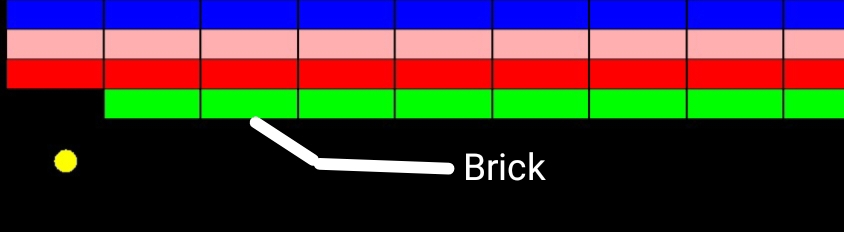

# Breakout Game (Java)

A simple Breakout Game built using Java Swing and AWT.  
Control the paddle, bounce the ball, and break all bricks to win!

---

## Features

- Brick breaking mechanics  
- Score system  
- High score saved using file handling  
- Pause / Resume functionality (SPACE key)  
- Restart after Game Over (R key)  
- Game Over if the ball misses the paddle  
- Colorful brick design  
- Sound effect on brick hit  

---

## Technologies Used

- Java  
- Swing (GUI)  
- AWT  
- File Handling  

---

## Controls

| Key         | Action              |
|-------------|--------------------|
| Left Arrow  | Move paddle left   |
| Right Arrow | Move paddle right  |
| Space       | Pause / Resume     |
| R           | Restart game       |

## How to Run

1. Open Terminal  
2. Navigate to the project folder:

cd "Libgdx Projects"

3. Compile all Java files:

javac *.java

4. Run the game:

java Breakout

## Screenshots

## Author

_2023831010 
_2023831023